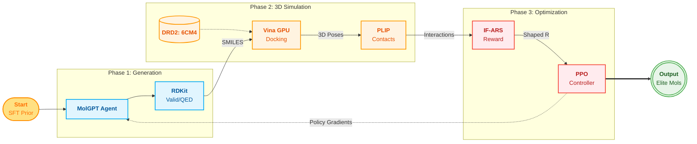

# Phase 1: System Architecture & Methodology

For your final year project presentation, flowcharts generated directly by AI image generators (like Midjourney or DALL-E) often have garbled, unreadable text. 

The industry standard for presentations is to use a **Mermaid diagram**. You can copy the code below and paste it into [Mermaid Live Editor](https://mermaid.live/) or [Draw.io](https://app.diagrams.net/), which will instantly generate a crisp, high-resolution SVG or PNG that you can export for your PowerPoint slides.

## 1. High-Resolution System Architecture Diagram

## 2. Slide Bullet Points: Component Breakdown

To accompany the diagram on your slides, here is a polished breakdown of the architecture you can use:

### **Generative Agent (MolGPT)**
* **Role:** Acts as the policy network.
* **Mechanism:** A transformer-based autoregressive model that generates novel molecular structures (SMILES) token-by-token. Initialized with pre-trained weights (SFT Prior) to ensure valid chemical syntax.

### **Chemical Environment (RDKit)**
* **Role:** Initial 1D/2D filter.
* **Mechanism:** Instantly rejects chemically invalid structures. Computes foundational metrics like Quantitative Estimate of Druglikeness (QED), Synthetic Accessibility Score (SAS), and Lipinski's Rule of 5 to ensure baseline viability before expensive 3D compute.

### **3D Docking & Scoring (AutoDock Vina)**
* **Role:** The physical simulator.
* **Mechanism:** Receives the DRD2 target structure (PDB: 6CM4). It converts the valid 2D SMILES into 3D conformers, docks them into the binding pocket, and calculates the thermodynamic binding affinity ($\Delta G$ in kcal/mol).

### **Interaction Analysis (PLIP)**
* **Role:** The structural pharmacophore engine.
* **Mechanism:** Analyzes the 3D docked poses to detect specific non-covalent interactions (e.g., hydrogen bonds, salt bridges) with critical target residues, such as **ASP114**.

### **IF-ARS Reward Shaping Engine**
* **Role:** The "Credit Assignment" bridge.
* **Mechanism:** Interaction-Forced Adaptive Reward Scheduling (IF-ARS). It maps the 3D spatial interactions identified by PLIP back to the specific 1D SMILES tokens that formed them, solving the spatial-to-sequential credit assignment problem.

### **RL Controller (PPO)**
* **Role:** The optimization loop.
* **Mechanism:** Proximal Policy Optimization (PPO) uses the shaped rewards to update the MolGPT's weights. It employs KL Divergence regularization against the frozen SFT Prior to prevent mode collapse and maintain molecular diversity.
